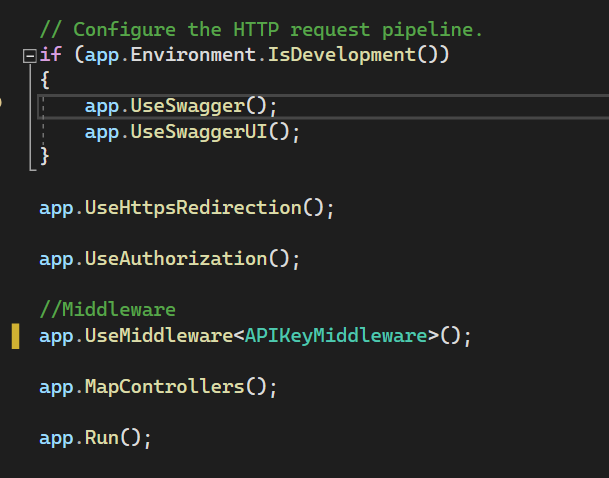
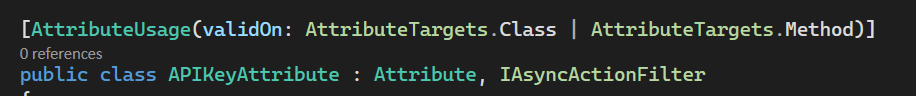
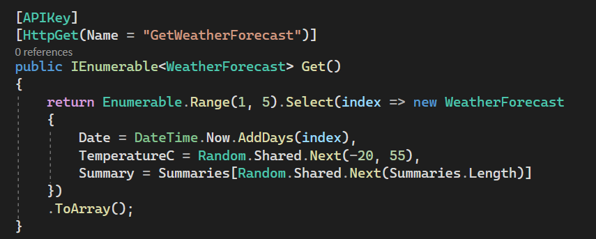
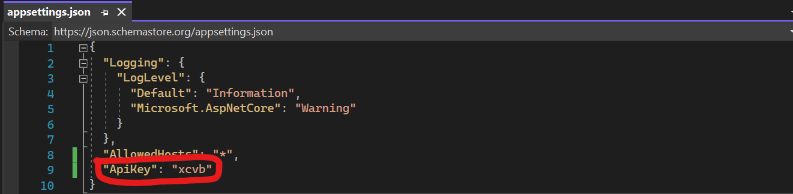
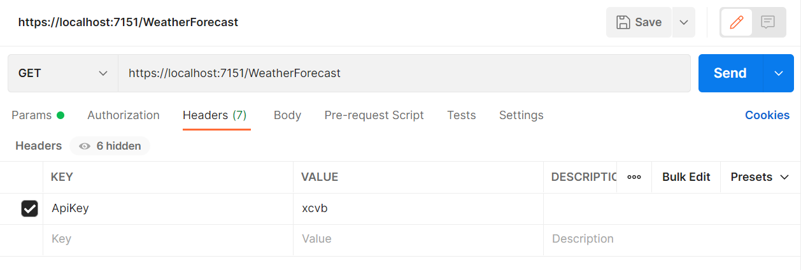

# API Key Implementation for ASP Net Core
## API Key Middleware
Contained in this repository is an example of implementing API Key Authentication through middleware. However this example applies the API Key Authentication to all of the API actions.
 

 
## API Key Action/Class Attribute
Contained in this repository is an example of implementing API Key Authentication through attributes. This attribute can be applied at both the class and method levels as `[APIKey]`.
 

 
## Definition of Single API Key
The API Key is defined in the `appsettings.json` file as `APIKey`.
 

 
## Example API Request

